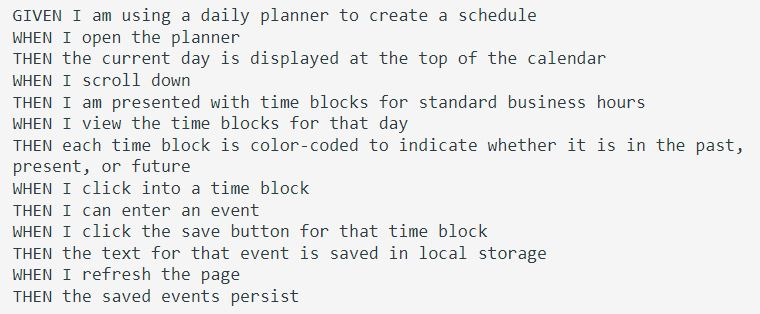
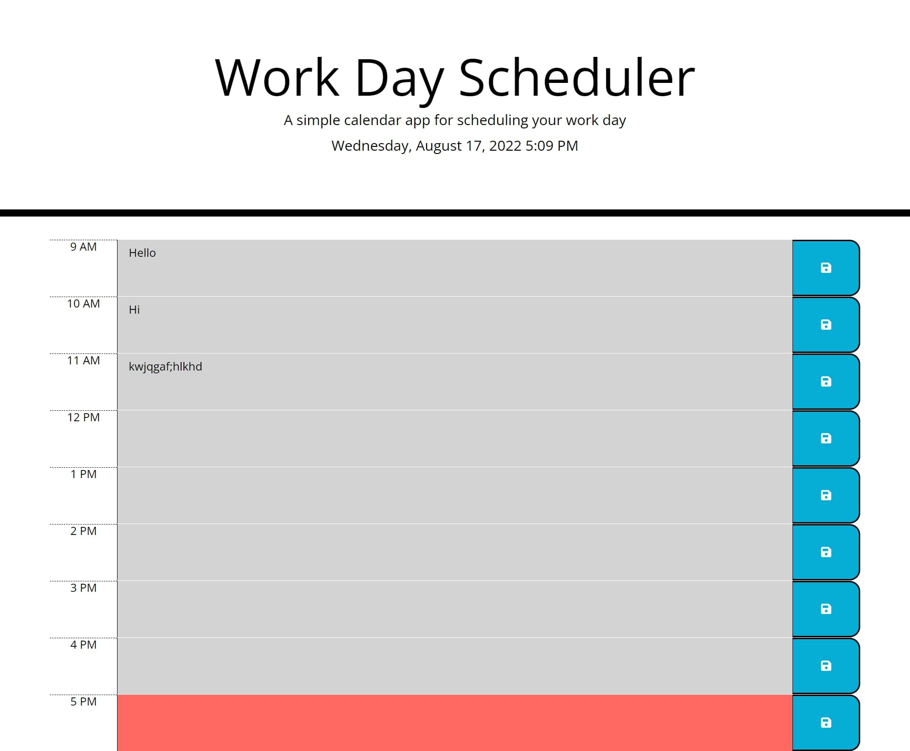

# Work Day Scheduler Starter Code

## Description/Acceptance Criteria

## Plan of attack
- Build HTML elements that will hold the hour, text-area input, and save button.
- Assign them unique identifiers (data-ids).
- Style them with bootstrap classes, and custom css classes.
- Use moment.js to display the current time in the header. 
- Build logic in JavaScript, using jQuery to create variables that hold current time.
- Build DOM representations of the timeblock elements in JavaScript. 
- Build a function that compares the moment time to the work-hour time in JavaScript. 
- Dynamically assign classes to timeblock elements depending on their past, present or future.
- Build a function that will store the information in localStorage.
- Retrieve the data from localStorage using data-ids to ensure persistence. 

## Screenshot of completed application

### Deployed Github Pages Link

